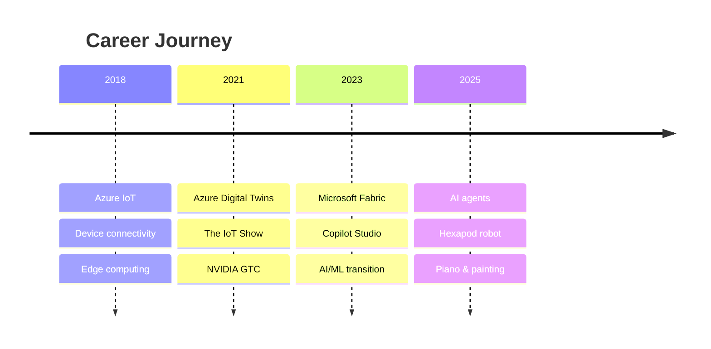

---

## Currently

- **Building AI agents and Copilot experiences** at Microsoft
- **Game prototypes** - orbital mechanics simulations, creative management concepts
- **Hexapod robot** - six-legged chaos controlled from a Raspberry Pi
- **Learning piano**
- **Trail running** - Scottish hills, East Lothian coastline
- **Painting**

---

## The Setup

A Raspberry Pi running an AI agent that controls LED strips, monitors garden sensors, tracks aircraft overhead, and occasionally makes my hexapod dance.

  

---

## Timeline

---

## Previously

Back when IoT was my thing, I got to appear on a couple of streams:

  
  &nbsp;&nbsp;
  

  <i>The IoT Show  |  NVIDIA GTC</i>

---

## Stats

  

---

  <i>I build things, break things, and occasionally write about it.</i>

